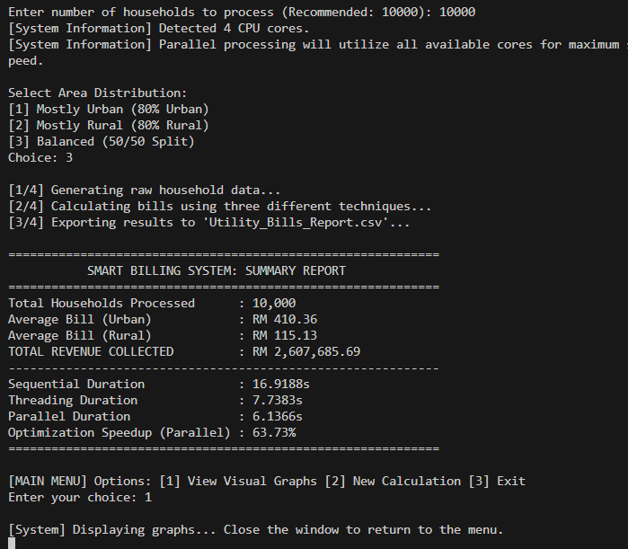
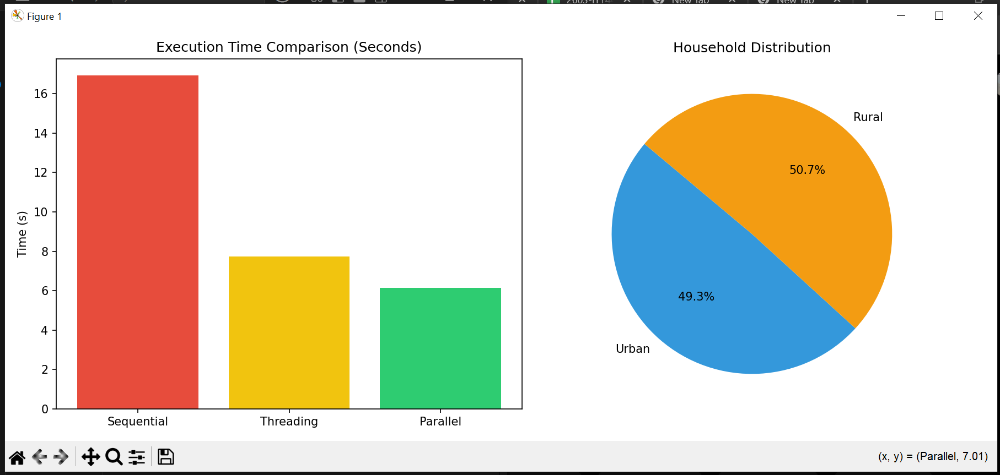
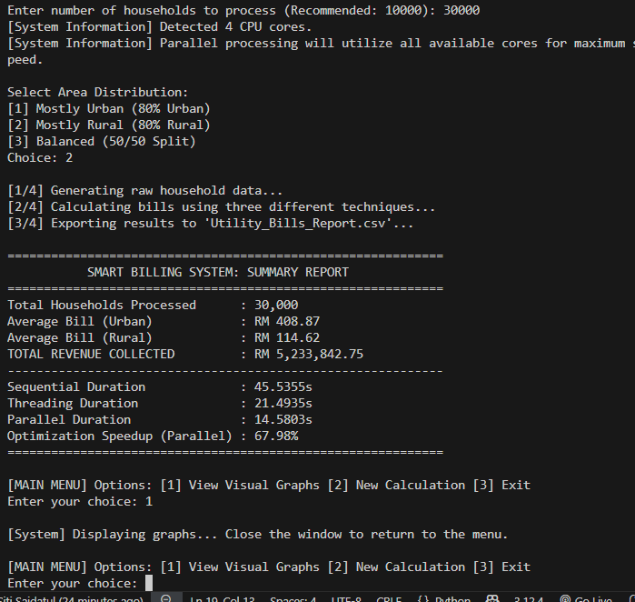
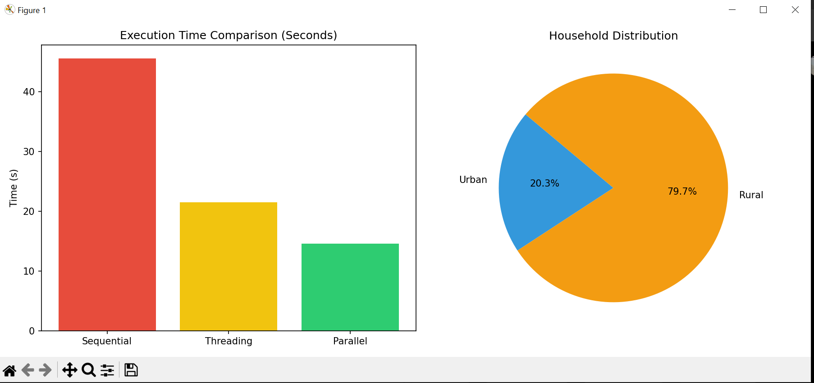
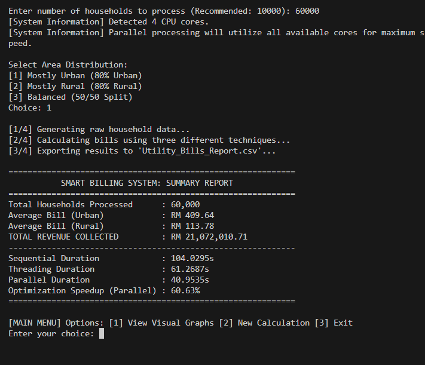
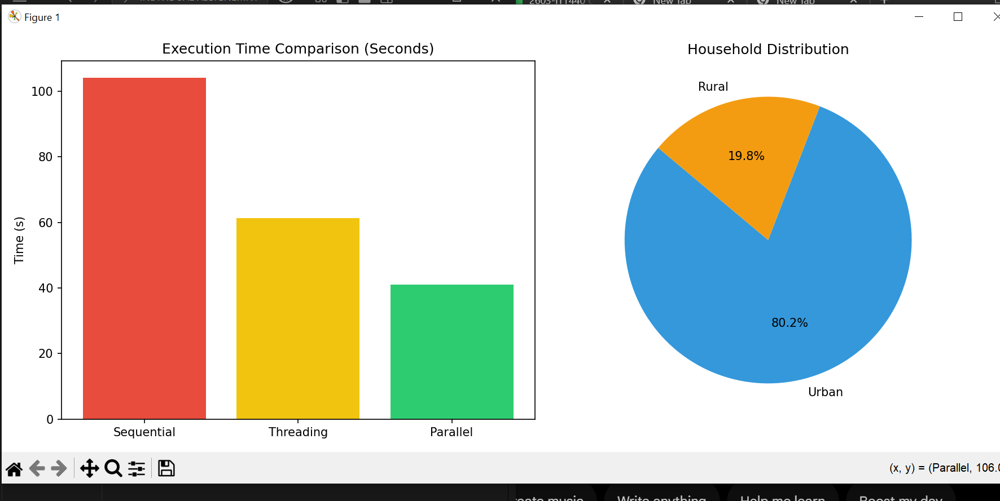

# ⚡ Parallelized Smart Utility Billing System ⚡

<p align="center">
  
</p>

### 📝 *ITT440 - INDIVIDUAL ASSIGNMENT*

**👨‍🎓 NAME : SITI SAIDATUL SYAHIRAH BINTI HISAMUDIN**

**🎓 STUDENT ID : 2025427336**

**👥 GROUP : M3CS2554C**

---

## 📝 Project Overview
This project is an advanced simulation of a utility billing system designed to demonstrate the performance differences between **Sequential**, **Multi-threading**, and **Parallel Processing** (Multiprocessing). It generates large-scale household data, calculates electricity bills based on tiered tariffs, and exports comprehensive reports.

---

## 💻 System Requirements
To run this application smoothly, ensure your system meets the following:
* **Language:** Python 3.8 or higher.
* **Operating System:** Windows, macOS, or Linux.
* **Hardware:** Multi-core CPU (Minimum 4 cores recommended for Parallel gains).
* **Libraries:** `matplotlib` (for data visualization)
    * `multiprocessing` (built-in)
    * `threading` (built-in)

---

## 🛠️ Installation Steps

### 1. Clone the Repository:
```bash
git clone [https://github.com/YourUsername/Smart-Billing-System.git](https://github.com/YourUsername/Smart_Bil-Utility.git)
cd Smart_Bil_Utility
```

### 2. Install Dependencies:
The project uses `matplotlib` for generating performance charts. Install it via the terminal:
```bash
pip install matplotlib
```

### 3. Run the Application: 
```bash
python smart_utility_bil.py
```

---

## 🚀 How to Run the Program

Follow these steps to interact with the billing simulation:

1.  **Launch the Script:**
    Open your terminal in VS Code and run:
    ```bash
    python smart_utility_bil.py
    ```

2.  **Enter Input Volume:**
    When prompted, enter the number of households. To see the best performance from Parallel processing, try:
    * `10000` (Small test)
    * `30000` (Medium load)
    * `60000` (Stress test)

3.  **Configure Distribution:**
    Select how the data is generated:
    * `1` - Mostly Urban (Higher consumption)
    * `2` - Mostly Rural (Lower consumption)
    * `3` - Balanced Split

4.  **Analyze the Summary Report:**
    The system will output a table showing the **Sequential**, **Threading**, and **Parallel** durations.

5.  **Navigate the Interactive Menu:**
    * Enter `1`: Opens a window displaying the **Execution Time Comparison** (Bar Chart) and **Household Distribution** (Pie Chart).
    * Enter `2`: Restarts the process for a new calculation.
    * Enter `3`: Safely exits the system.

---

## 📊 Performance Benchmarks (Sample I/O)

The data below represents actual test runs. Note the significant reduction in time when moving from Sequential to Parallel execution.

| Households | Sequential Time | Threading Time | Parallel Time | Speedup (%) |
| :--- | :---: | :---: | :---: | :---: |
| **10,000** | 16.9188s | 7.7383s | 6.1366s | **63.73%** |
| **30,000** | 45.5355s | 21.4935s | 14.5803s | **67.98%** |
| **60,000** | 104.0295s | 61.2687s | 40.9535s | **60.63%** |

---

## 📸 Screenshots

Below are the execution results for the three test categories, showing the significant performance boost as the data volume increases.

### 🔹 Category 1: 10,000 Households
**Processing Summary:** Optimized speedup of ~63%.
| Console Output | Visual Analytics |
| :--- | :--- |
|  |  |

---

### 🔹 Category 2: 30,000 Households
**Processing Summary:** Efficiency remains high at ~67% speedup.
| Console Output | Visual Analytics |
| :--- | :--- |
|  |  |

---

### 🔹 Category 3: 60,000 Households
**Processing Summary:** Handling massive data with ~60% optimization.
| Console Output | Visual Analytics |
| :--- | :--- |
|  |  |

---

## 📂 Source Code Highlight

The core of this system is the **Multiprocessing Pool**, which utilizes the full power of your CPU cores.

```python
# --- Multiprocessing (Parallel) Implementation ---
# This section bypasses the GIL to run calculations in true parallel
start_par = time.time()
with Pool() as pool:
    final_results = pool.map(process_household, households)
par_duration = time.time() - start_par
